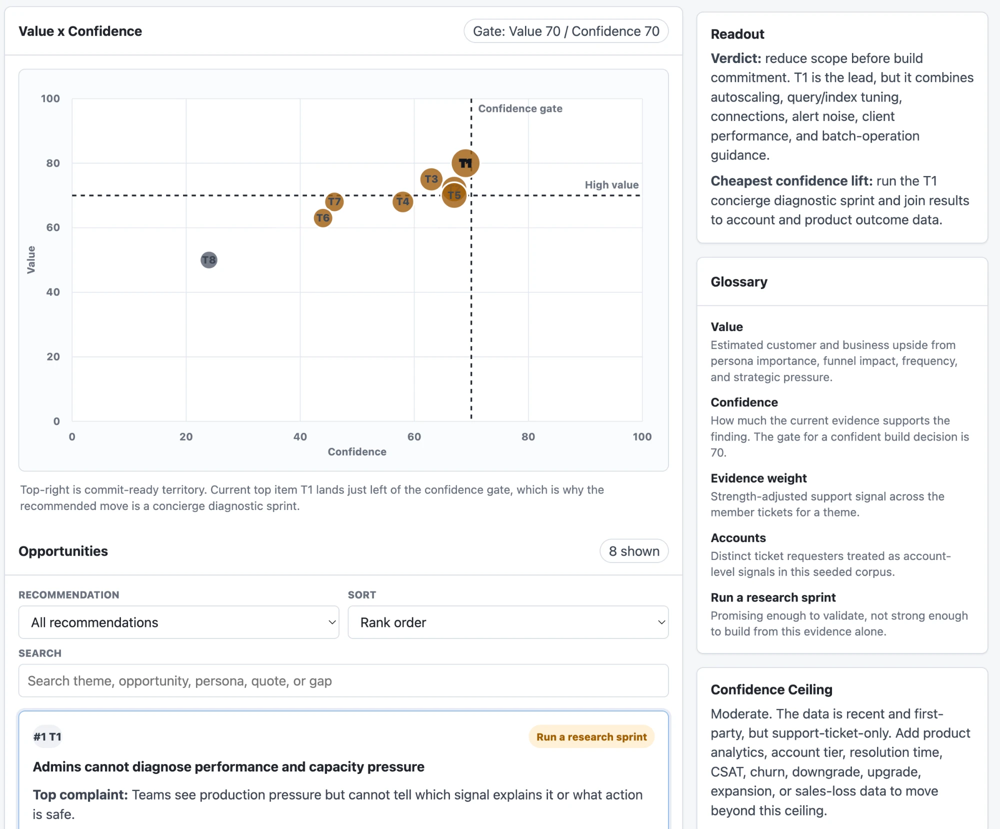
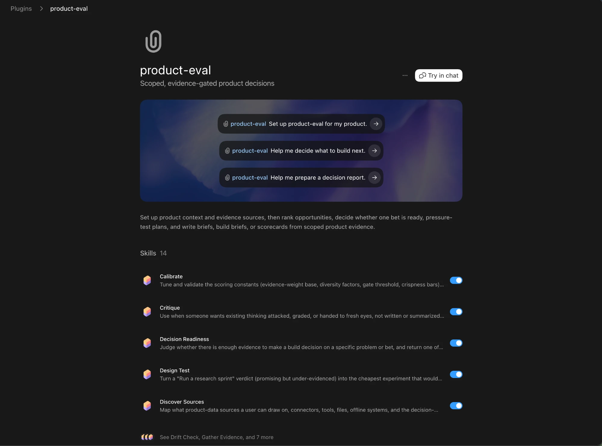
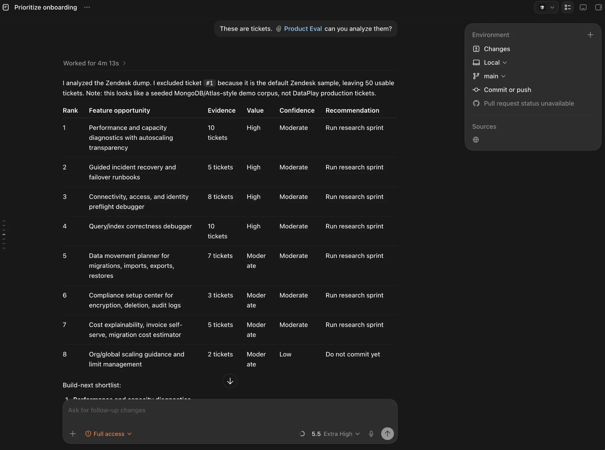
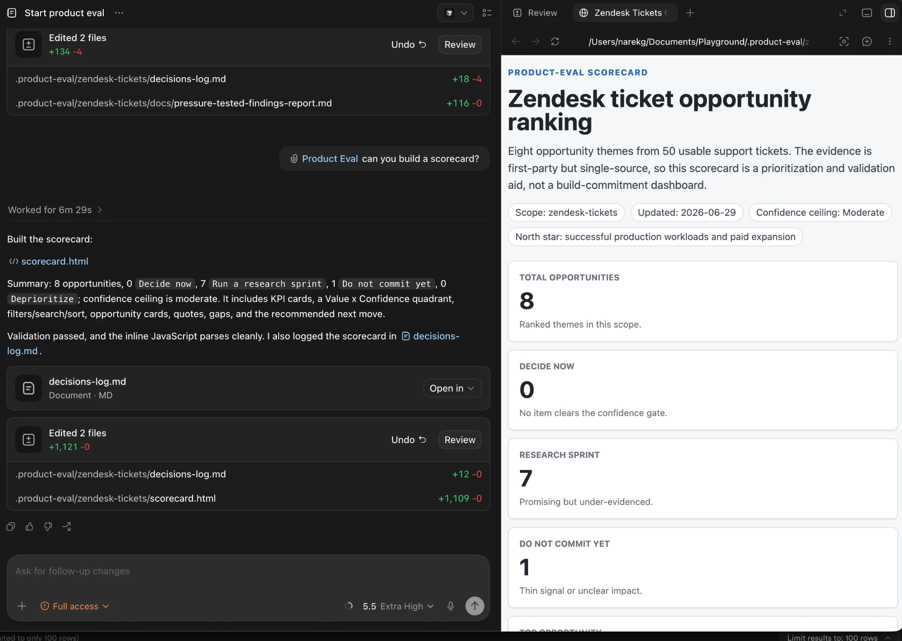

# product-eval

**Find what's worth building next, with the evidence to prove it.**



product-eval discovers and analyzes real customer problems from the tools where they already live: support tickets (Zendesk), CRM (Salesforce, HubSpot), issue trackers (Jira), product analytics, and reviews. It weighs the evidence, ranks what matters, and builds a prioritized, evidence-backed narrative of the problem worth solving.

When a bet is ready, hand it off: export a brief or decision memo, or pass a build spec straight to a wireframing tool or an AI coding agent like Codex or Claude Code to ship an MVP. It runs in both Claude Code and Codex, and keeps the rigor (evidence weighting, readiness gates, audit files) behind a simple, outcome-first chat.

It helps you answer four practical questions:

- **Rank opportunities:** what should we build next?
- **Decide on one bet:** is this worth building now, or do we need more proof?
- **Pressure-test a plan:** where is this roadmap, PRD, or strategy weak before we commit?
- **Write the output:** turn an approved decision into a brief, decision memo, build spec, or visual scorecard.

The plugin keeps the rigor behind the scenes: it can discover available sources, gather and weight evidence, synthesize themes into buildable problems, score Value and Confidence, check decision readiness, and produce decision artifacts. Users should not need to choose those internal steps directly; they can describe the outcome they want.

## Install



**Cowork:** open the `.plugin` file. It renders as an installable card; click to add it.

**Claude Code:** add this directory or its hosting repo as a plugin marketplace, then install:

```text
/plugin marketplace add <path-or-repo>
/plugin install product-eval
```

**Codex:** this source is Codex-compatible through `.codex-plugin/plugin.json`. For Codex marketplace installation, place or symlink this folder as `<marketplace-root>/plugins/product-eval`, make sure that marketplace root is registered with Codex, then install `product-eval` from that marketplace. This repo cleanup does not create or edit global Codex marketplace config such as `~/.agents/plugins/marketplace.json`.

**Quick install (either tool, no marketplace):** clone this repo and run `./install.sh`. It symlinks the 14 skills into `~/.claude/skills` and `~/.agents/skills`, so a later `git pull` keeps them current. In Codex, invoke a skill explicitly with `$<skill-name>` (for example `$start`).

After installing, start by setting up the product context and decision:

- "Set up product-eval for my product."
- "Help me decide what to build next."
- "Help me prepare a decision report."
- "Pressure-test this Q3 roadmap using the evidence in our current scope."

On first run, product-eval should ask for the product, target users, decision goal, scope/time horizon, available evidence sources, and the metric or business constraint that should shape the recommendation. It should not rank a vague area like "onboarding" or judge a bet like "SSO" until the product context and evidence plan are clear, unless you explicitly ask for an outside-in first pass with a lower confidence ceiling.

Each step should end with a **Next move** that points toward delivery: upload the evidence, rank the candidates, run the readiness call, pressure-test the plan, write the decision memo, render the scorecard, or hand a build brief to Codex/design.

## 60-second demo

Point it at your customer signal and ask for the outcome. For example, hand it a support-ticket export in Codex:

> "These are our support tickets. Can you analyze them?"

product-eval runs the full chain (gather and weight evidence, synthesize themes, score Value and Confidence, run the readiness gate) and returns a ranked shortlist with a verdict on each.



Ask for a scorecard and it builds a self-contained, shareable HTML dashboard:

> "Can you build a scorecard?"



No data of your own? It also works top-down from a domain ("research the observability tooling space and tell me what's worth building"), reasoning from public signal and stating the resulting confidence ceiling. You can also open a ready-made example with zero setup: `examples/activation-q3/scorecard.html`.

## Outcome Modes

### Rank Opportunities

Use this when you have a product area, evidence pile, or backlog and want a ranked shortlist. The plugin gathers or reads evidence, turns themes into buildable problem statements, scores each item by Value and Confidence, and returns a ranked table with the best next move.

### Decide On One Bet

Use this when you have one idea or problem and need a yes/no readiness call. The output leads with one of three outcomes:

- **Decide now:** enough credible, diverse evidence to commit.
- **Run a research sprint:** promising, but one specific proof gap should be closed first.
- **Do not commit yet:** evidence is too weak, vague, stale, or single-source.

Evidence math is kept visible for audit, but the decision is presented as a banded verdict rather than false precision.

### Pressure-Test A Plan

Use this when a roadmap, PRD, strategy, or bet already exists and you want the weak spots surfaced before committing. The output is blocking issues, suggestions, strengths, and a ready / needs-fixes / not-ready verdict.

### Write The Output

Use this after a decision has enough evidence or when you need a decision artifact:

- **Opportunity Brief:** persuade and align humans around the problem, why now, impact, and ask.
- **Decision Memo:** force a specific yes/no or option choice with criteria, metrics, tradeoffs, and deadline.
- **Build Brief:** hand an approved decision to a code or design agent with testable requirements.
- **Scorecard:** render ranked opportunities and verdicts as a shareable HTML dashboard.

Use **critique** when you want an independent adversarial read of findings, a problem statement, a brief, or an FAQ. Use **pressure-test** when you already have a roadmap, PRD, plan, or bet and want to find the weak spots before committing.

## Decision Model

A decision passes a two-stage gate:

1. **Sufficiency gate:** blocks if evidence weight is too low, all evidence is weak, evidence comes from only one independent source type, or the problem statement is vague.
2. **Confidence verdict:** combines evidence weight, source diversity, contradictions, and Value into a recommendation.

The chat output should show **bands first**: Low / Moderate / High Confidence and the resulting verdict. Exact Value and Confidence numbers are stored in `.product-eval/<scope>/` files for audit, calibration, and scorecards.

## State: `.product-eval/<scope>/`

All investigation state lives inside the user's project repo so it versions with code and can be reviewed in pull requests. Each investigation gets its own scope:

```text
.product-eval/
  <scope>/
    context.md          business context: product, north star, personas
    sources.md          discovered sources, coverage, confidence ceiling
    evidence/           one file per evidence item
    identities.md       resolved person/account map across sources
    themes.md           problem-framed themes with gaps and confidence
    scores.md           exact Value + Confidence numbers for audit
    decisions-log.md    append-only verdicts, overrides, drift, docs
    snapshots/          timestamped copies for drift checks
    docs/               briefs and decision memos
    build/              agent-ready build/design briefs
  calibration.yml       optional workspace-level scoring overrides
```

If `.product-eval/<scope>/` does not exist, the first run creates or proposes a short scope name. Skills degrade gracefully when files or sources are missing and state the resulting confidence ceiling.

## Validation

Run the plugin/package checks:

```text
python3 evals/checks/validate_plugin.py
```

Run the scope fixture validator after installing its dependency:

```text
python3 -m pip install -r scripts/requirements.txt
python3 scripts/validate_scope.py examples/activation-q3
```

## Design Principles

- **Outcome-first UX.** Users ask for Rank, Decide, Pressure-test, or Write; internal skills do the routing.
- **Evidence as described, not ground truth.** The plugin rates credibility, diversity, and recency. It does not prove that every cited number is objectively true.
- **Honest ceilings.** Every verdict states the maximum confidence the connected or provided sources allow and how to raise it.
- **Evidence is weighted, not counted.** Strong first-party findings outweigh many weak anecdotes.
- **Plain files, no daemon.** Skills read and write markdown/YAML under `.product-eval/<scope>/`; git provides history.

## Roadmap

- Calibration and reality-testing against more closed decisions.
- Trigger eval hardening for the outcome modes and scorecard.
- Cross-scope portfolio view: a roll-up of what is decided, waiting on evidence, or drifting across investigations.
- Scale-out clustering for large evidence corpora when map-reduce synthesis is not enough.
